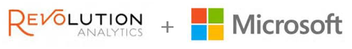
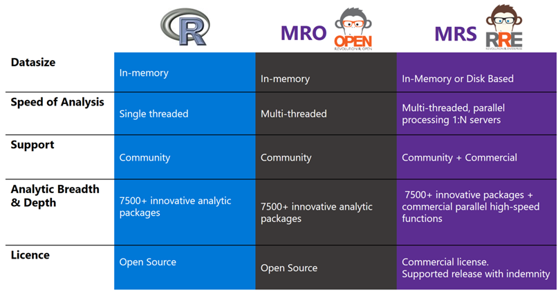
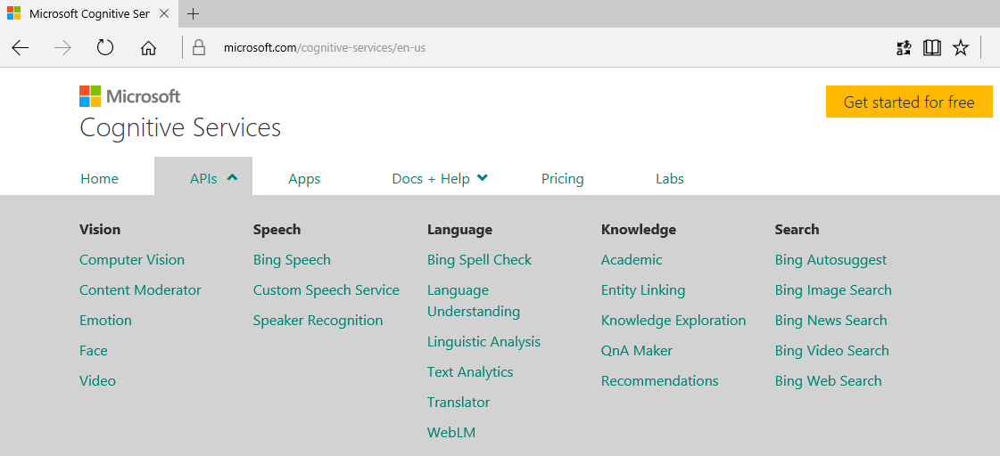
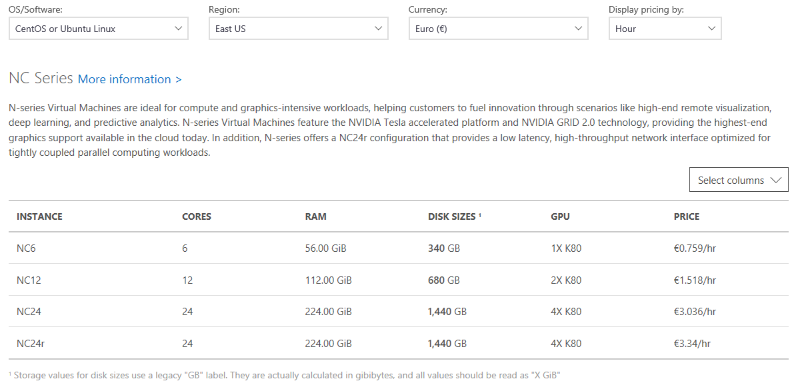
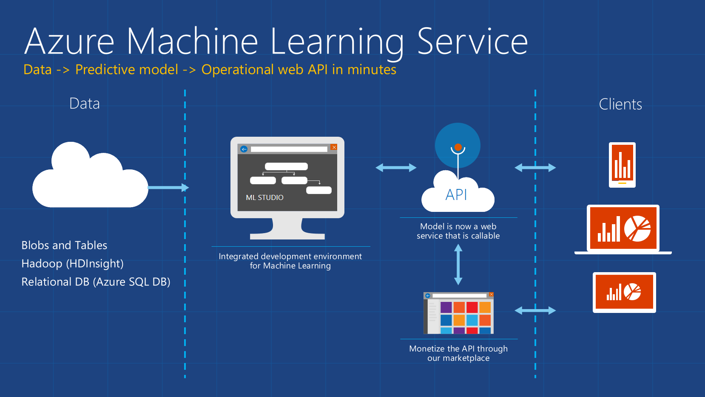

# Introduction - Machine Learning & Azure

## R

[APR 2015 - Microsoft Closes Acquisition of Revolution Analytics](https://blogs.technet.microsoft.com/machinelearning/2015/04/06/microsoft-closes-acquisition-of-revolution-analytics/)

R is integrated in:
- SQL Server 2016 (on premises, in Azure VMs, ...)
- HDinsight (Hadoop as a service on Azure)
- Linux
- Windows
- Teradata
- Power BI
- Azure ML
- ...

## Python

Python is also integrated in some Microsoft products like Azure ML

## Cognitive Services

[Cognitive Services](https://www.microsoft.com/cognitive-services/en-us/apis)

## GPU

## Azure Machine Learning

Get started at <https://studio.azureml.net>

[Azure Machine Learning Pricing](https://azure.microsoft.com/en-us/pricing/details/machine-learning/)

## more

- [The Microsoft Cognitive Toolkit - CNTK](https://www.microsoft.com/en-us/research/product/cognitive-toolkit/)
- research: <https://www.microsoft.com/en-us/research> 
- blogs
    - <https://blogs.technet.microsoft.com/machinelearning/>
    - <https://blogs.microsoft.com/next>
    - ...
- news: <https://news.microsoft.com/ai/>
