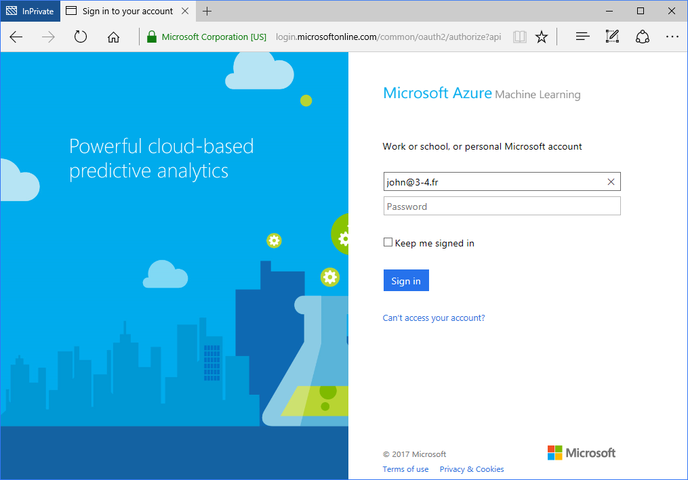
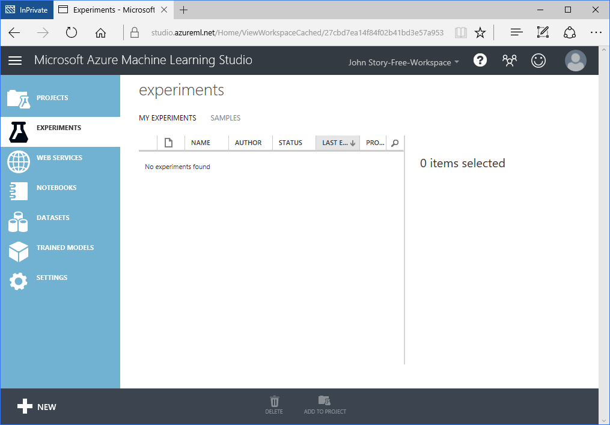

# Start for free

- browse to https://studio.azureml.net
- Clic on `Sign In`: 
- you can sign in with a Microsoft Account or create one if you don't have one

If you already have a Microsoft Account (@outlook.com, @hotmail.com, ...) this can be as simple as: 

The restrictions you may have with a free account are explained in the table at <https://azure.microsoft.com/en-us/pricing/details/machine-learning/>. See the first table and the FAQ.
