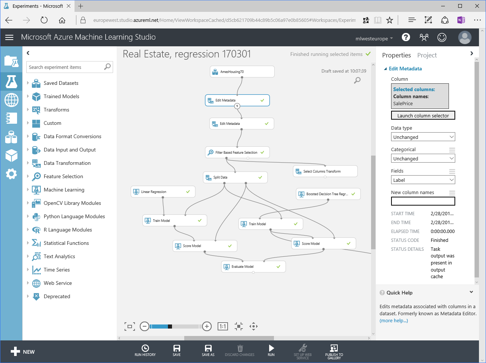
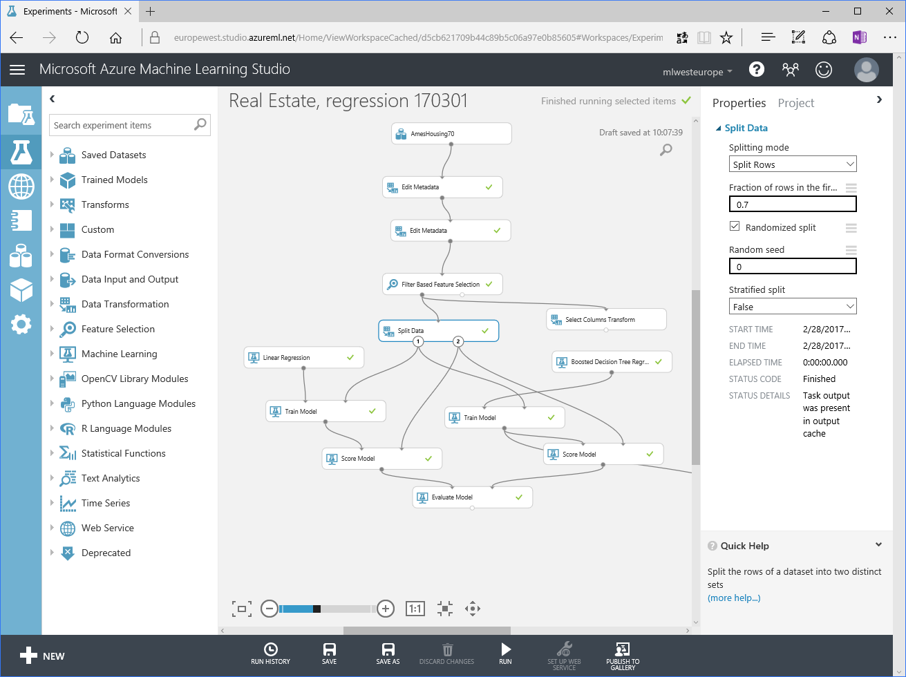
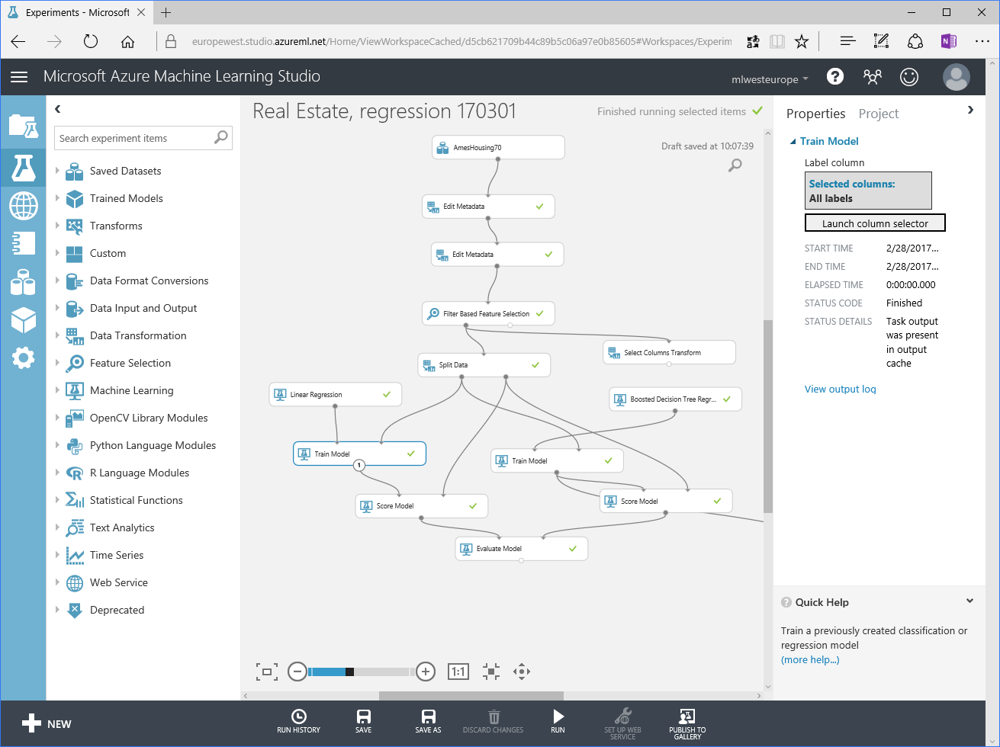
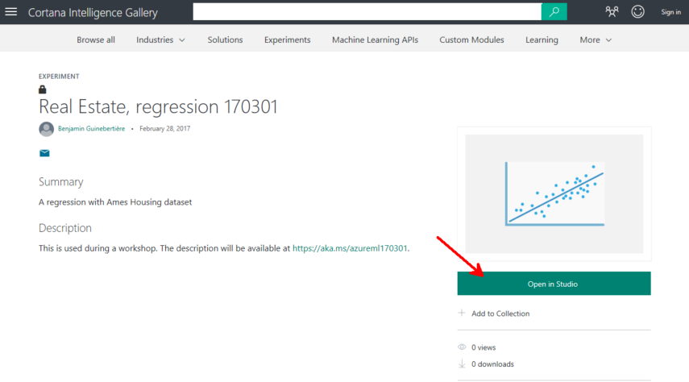

# create a model and expose it as a web service

## experiment

The goal is to construct and expose as a web service the following experiment: 


## challenge

Of course, there must be better means of solving the problem. 

So let's have a mini challenge. 

Those who want can build a model based on AmesHousing70, with the highest coefficient of determination when testing against AmesHousing30 dataset.


The experiment must run in Azure ML Studio, but it can leverage R or Python. 

The author of the best experiment will present what he/she did at the end (10 minutes).

## dataset

Excerpt from <https://ww2.amstat.org/publications/jse/jse_data_archive.htm>

- [AmesHousing.txt](http://ww2.amstat.org/publications/jse/v19n3/Decock/AmesHousing.txt)
- [AmesHousing.xls](http://ww2.amstat.org/publications/jse/v19n3/Decock/AmesHousing.xls)
- [DataDocumentation.txt](http://ww2.amstat.org/publications/jse/v19n3/Decock/DataDocumentation.txt)

```
NAME: Ames, IA Real Estate Data
TYPE: Census
SIZE: 2930 observations, 82 variables (includes numeric and categorical)

SUBMITTED BY:
Dean De Cock
Department of Mathematics and Computer Science, Truman State University
100 E. Normal St., Kirksville, MO, 63501
decock@truman.edu
```

The AmesHousing.txt was uploaded to Azure ML then split randomly into 2: AmesHousing70 and AmesHousing30.

Sample data: 

```
Order	PID	MS SubClass	MS Zoning	Lot Frontage	Lot Area	Street	Alley	Lot Shape	Land Contour	Utilities	Lot Config	Land Slope	Neighborhood	Condition 1	Condition 2	Bldg Type	House Style	Overall Qual	Overall Cond	Year Built	Year Remod/Add	Roof Style	Roof Matl	Exterior 1st	Exterior 2nd	Mas Vnr Type	Mas Vnr Area	Exter Qual	Exter Cond	Foundation	Bsmt Qual	Bsmt Cond	Bsmt Exposure	BsmtFin Type 1	BsmtFin SF 1	BsmtFin Type 2	BsmtFin SF 2	Bsmt Unf SF	Total Bsmt SF	Heating	Heating QC	Central Air	Electrical	1st Flr SF	2nd Flr SF	Low Qual Fin SF	Gr Liv Area	Bsmt Full Bath	Bsmt Half Bath	Full Bath	Half Bath	Bedroom AbvGr	Kitchen AbvGr	Kitchen Qual	TotRms AbvGrd	Functional	Fireplaces	Fireplace Qu	Garage Type	Garage Yr Blt	Garage Finish	Garage Cars	Garage Area	Garage Qual	Garage Cond	Paved Drive	Wood Deck SF	Open Porch SF	Enclosed Porch	3Ssn Porch	Screen Porch	Pool Area	Pool QC	Fence	Misc Feature	Misc Val	Mo Sold	Yr Sold	Sale Type	Sale Condition	SalePrice
1	0526301100	020	RL	141	31770	Pave	NA	IR1	Lvl	AllPub	Corner	Gtl	NAmes	Norm	Norm	1Fam	1Story	6	5	1960	1960	Hip	CompShg	BrkFace	Plywood	Stone	112	TA	TA	CBlock	TA	Gd	Gd	BLQ	639	Unf	0	441	1080	GasA	Fa	Y	SBrkr	1656	0	0	1656	1	0	1	0	3	1	TA	7	Typ	2	Gd	Attchd	1960	Fin	2	528	TA	TA	P	210	62	0	0	0	0	NA	NA	NA	0	5	2010	WD 	Normal	215000
2	0526350040	020	RH	80	11622	Pave	NA	Reg	Lvl	AllPub	Inside	Gtl	NAmes	Feedr	Norm	1Fam	1Story	5	6	1961	1961	Gable	CompShg	VinylSd	VinylSd	None	0	TA	TA	CBlock	TA	TA	No	Rec	468	LwQ	144	270	882	GasA	TA	Y	SBrkr	896	0	0	896	0	0	1	0	2	1	TA	5	Typ	0	NA	Attchd	1961	Unf	1	730	TA	TA	Y	140	0	0	0	120	0	NA	MnPrv	NA	0	6	2010	WD 	Normal	105000
3	0526351010	020	RL	81	14267	Pave	NA	IR1	Lvl	AllPub	Corner	Gtl	NAmes	Norm	Norm	1Fam	1Story	6	6	1958	1958	Hip	CompShg	Wd Sdng	Wd Sdng	BrkFace	108	TA	TA	CBlock	TA	TA	No	ALQ	923	Unf	0	406	1329	GasA	TA	Y	SBrkr	1329	0	0	1329	0	0	1	1	3	1	Gd	6	Typ	0	NA	Attchd	1958	Unf	1	312	TA	TA	Y	393	36	0	0	0	0	NA	NA	Gar2	12500	6	2010	WD 	Normal	172000
```

## How to create the experiment

In <https://studio.azureml.net>

add the dataset:


add the `AmesHousing70.csv` that you can find in this repo (download it to your machine, then upload it to Azure ML).


create a new experiment: 


Change the title:


drag & drop the `AmesHousing70` dataset


Then drag & drop the other shapes as detailed below:




The columns transformation can be saved so that it does not depend on the dataset anymore


We'll see that later







for the right branch, you want to copy and paste a few modules instead of dragging and dropping.


If you want to evaluate the boosted decision tree model with HamesHousing30 dataset (for the challenge), you can do it that way:


## running late while creating the experiment ? 

You can copy the experiment in you workspace from the gallery.

<https://gallery.cortanaintelligence.com/Experiment/Real-Estate-regression-170301-1>




and run it


