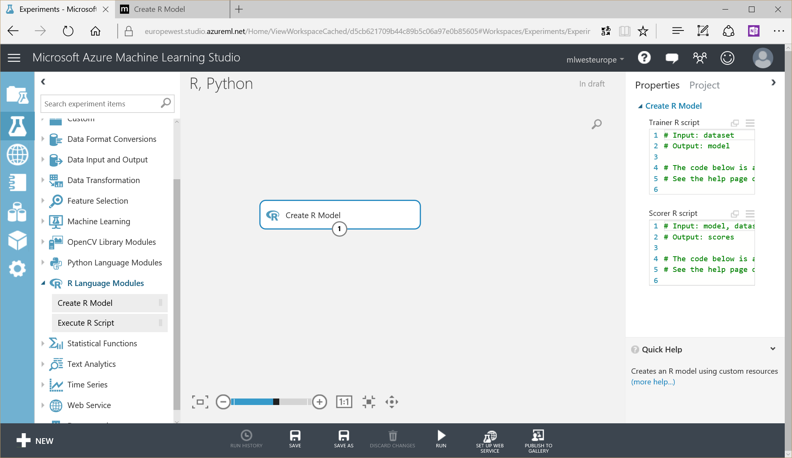

# R, Python, and Jupyter

## R

You can create a model from R: 

NB: You can also get more info by clicking on `(more help...)` on the bottom right of the screen while a module is selected

Or just execute some R script:

Please also refer to:
- <https://docs.microsoft.com/en-us/azure/machine-learning/machine-learning-extend-your-experiment-with-r>
- <https://docs.microsoft.com/en-us/azure/machine-learning/machine-learning-custom-r-modules>

## Python

You can execute some Python code: 

Please also refer to:
- <https://docs.microsoft.com/en-us/azure/machine-learning/machine-learning-execute-python-scripts>

## Jupyter

From you Azure ML free account you can use Jupyter notebooks.

NB: a similar service is available at <https://notebboks.azure.com>

You can start with a blank Jupyter notebook:

You can also have a look at the 2 following ones that show how to leverage Azure ML runtime without using the studio:

... in Python:

Excerpts: 

... in R:

Excerpts: 

